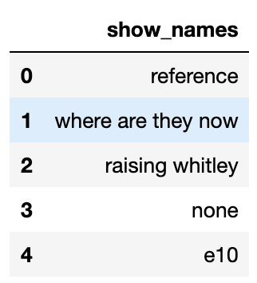
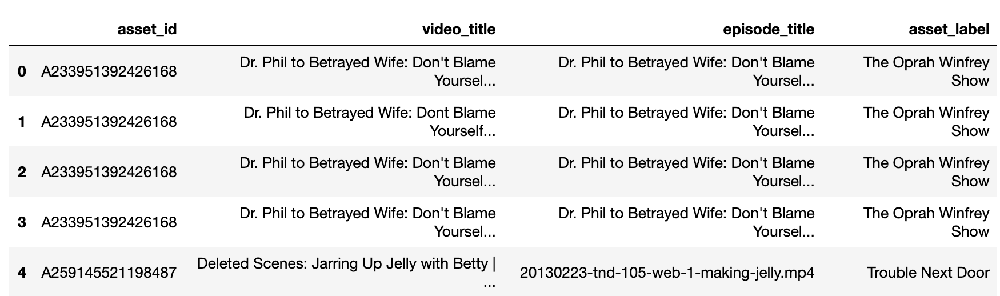
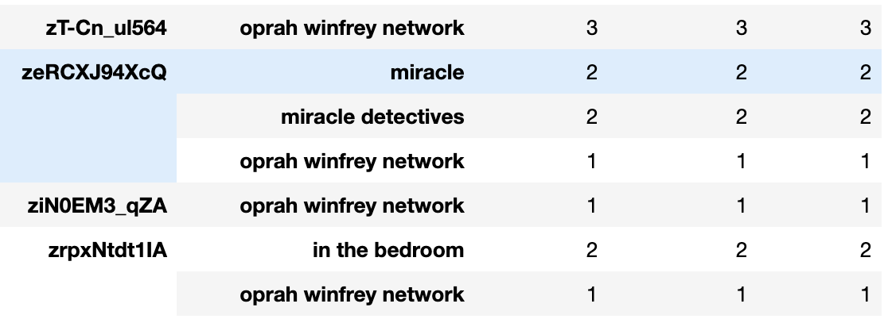

# assets_mapper
This python code is for the initial phrase of assets mapping for any brand clients. Mapping asset is a tough job, especially when you have tens of thousands of unmapped assets and don't know where to begin from.

# Prerequisites
documentations needed from your client's CMS
* asset report
* claim report

# 1st step
If you are not provided with a list of show names from your client, please go through line 1- line 15 of the codes. This helps you to extract is list of show names, as many of possible, from the asset report.

# 2nd step

# 3rd step
